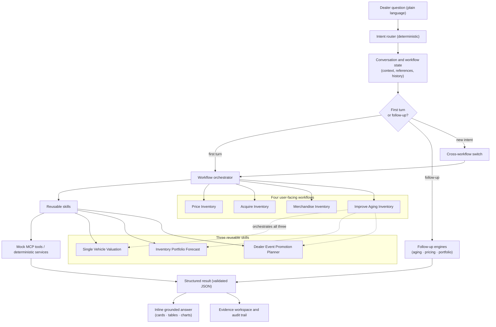

# Dealer AI Inventory Decision Assistant

A conversational prototype that helps used-vehicle dealers **price a vehicle, forecast the lot, plan
a sale event, and act on aging inventory** — by asking, in plain language, in one continuous thread.

The assistant interprets a dealer's request and coordinates deterministic pricing and inventory
capabilities. It brings the answer — cards, tables, and explanations — **into the conversation**,
preserves human approval, and keeps the evidence and audit trail behind every recommendation. The
guiding idea: **AI as an agent service, not another dashboard.**

> This is an independent prototype built with synthetic data and mock integrations. It is **not**
> a production Cox Automotive or vAuto product, and its outputs must not be used for real dealer
> pricing decisions.

---

## 1. What problem does this solve?

Used-vehicle dealers make inventory decisions that are hard to get right because the relevant
information lives on different screens, and the decision is rarely one question:

- **Pricing one vehicle** balances market position, margin, days on lot, and how fast it will sell —
  and a real dealer doesn't stop at the first number. They ask *"can I sell it faster? what's the
  profit trade-off? show me options. why this one?"*
- **Portfolio decisions** ("should I buy more?") depend on what the lot will sell in the coming
  weeks, how full it is today, which units are dragging, and what to fix first.
- **Promotion planning** works best when you pick the *right* vehicles for an event, not discount
  everything.
- **Aging inventory** is the hardest case: what to do with a car that has sat too long spans pricing,
  wholesale disposition, merchandising, inbound pressure, and approval limits — several tools, several
  screens.

Most dealer tools **show the data on separate screens and leave the person to connect the decision by
hand.** A dealer ends up tab-hopping across dashboards to answer a single follow-up.

**The product hypothesis:** a conversational decision layer can interpret the dealer's intent,
coordinate existing pricing and inventory capabilities, and **deliver the whole decision — including
the tables — inside the conversation**, *without* replacing the deterministic business logic that
produces the numbers.

---

## 2. Business value

The point of this prototype is not a new algorithm — it is a better **decision experience** around
trusted capabilities. That value splits cleanly between the dealer and the business.

### For the dealer (the user)

| Value | How it shows up in the product |
| --- | --- |
| **The whole decision in one conversation** | Ask a price, re-target by days, compare strategies, pick one, ask why — *without repeating the vehicle* and without opening a dashboard. |
| **Fewer clicks, no tab-hopping** | The lot's health, the 30-day outlook, the riskiest units, and the pre-acquisition checklist all arrive inline in the thread — the four dashboard tabs come to you. |
| **Transparent trade-offs** | Every recommendation carries its *why* — market position, expected days, gross, break-even cushion — in plain language, not just a number. |
| **Confidence under time pressure** | The dealer sees the reasoning and the downside, so they can act rather than second-guess. |
| **The dealer stays in control** | Selecting a strategy marks it *"for review"*; nothing is ever published. The AI proposes, the dealer decides. |

### For the business / enterprise

| Value | Why it matters |
| --- | --- |
| **AI orchestrates trusted engines — it doesn't replace them** | The pricing, forecasting, and promotion engines stay independent, validated services. The LLM handles intent, orchestration, and explanation — protecting existing IP and correctness. |
| **Every number is reproducible and auditable** | Figures come from seeded, deterministic services with request and simulation IDs — not model output. |
| **Agent UX meets users where they already are** | A conversation, not a training exercise on yet another dashboard. |
| **A safe adoption pattern** | Human-in-the-loop approval, no auto-publish, and "earn autonomy before adding it" — the posture an enterprise needs to trust AI in a pricing workflow. |

**Concrete outcomes a dealer can reach in one thread:**

- *"Price this RAV4"* → 20-day target → compare Protect-Profit / Balanced / Sell-Faster → pick
  Balanced → "walk me through why" — a full pricing decision, five turns, one vehicle, never
  re-identified.
- *"What does my lot look like today?"* → the 30-day outlook → the 5 riskiest units and why → what to
  review before acquiring — a full acquisition decision, **without opening the Acquire dashboard.**

---

## 3. Design purpose — what makes this an AI product

There are two layers, and keeping them separate is the whole point.

**The conversational and orchestration layer** interprets what the dealer wants and coordinates the
work. It routes intent to the right workflow, resolves references ("the BMW", "the RAV4", "Summer
Clearance"), keeps context across turns, drives multi-turn follow-ups, switches workflows when the
dealer starts a new task, explains structured results in dealer language, and asks for clarification
when something is missing.

**The deterministic business services** produce **every number**: price, break-even, the safe pricing
floor, expected days to sale, front-end gross, holding-cost and depreciation exposure, portfolio
forecasting, event-plan outcomes, and approval conditions.

> **The language model does not replace the pricing engine.** It interprets the request, calls
> existing capabilities, and explains their validated results.

**Enterprise AI orchestration.** The most important idea is not any single skill — it is that **an LLM
coordinates several trusted, deterministic business capabilities to solve one dealer problem.** That is
the same division of labor as Microsoft Copilot, Salesforce Agentforce, or ServiceNow's AI Agent: the
model owns intent understanding, workflow orchestration, evidence synthesis, explanation, and human
decision support — the domain engines own the math.

A single-vehicle question makes this concrete. Ask **"I've had this F-150 for 92 days — what should I
do?"** and the orchestrator (`agents/vehicle_advisor.py`) detects the intent, invokes all three
capabilities (Single Vehicle Valuation, Portfolio Forecast, Event Promotion Planner), aggregates their
outputs, and synthesizes **one prioritized action plan** — reduce the price, include it in the
campaign, refresh the merchandising — where every figure is copied from a skill, each step carries its
**evidence and trade-offs**, and the plan ends at a **human approval gate**, never an automatic
write-back.

In this prototype the conversational layer is **primarily deterministic** — routing, reference
resolution, follow-up classification, and answer text are rules over the structured result, not model
guesses. An optional guarded-narration pattern exists for prose, constrained so a model can never
state a number the engine did not produce.

*(**MCP** = Model Context Protocol, a standard way for an assistant to call external tools. Here every
MCP tool is **mocked** — see [section 10](#10-prototype-data-and-mcp-boundary).)*

---

## 4. What can the tool do?

The tool is organized around four **workflows** — the jobs a dealer actually has — ordered for the
demo narrative *individual pricing → portfolio management*. Open a workflow from the sidebar, or just
ask the Assistant in plain words and it routes you.

| Workflow | A dealer would ask… | Decision it supports | Core capability |
| --- | --- | --- | --- |
| **Price Inventory** | "What should I price this vehicle?" | One-vehicle price vs market, margin, floor, and time to sale | Single Vehicle Valuation |
| **Acquire Inventory** | "What does my lot look like, and what can it absorb?" | Lot health, 30-day outlook, unit-level risk, acquisition readiness | Inventory Portfolio Forecast |
| **Merchandise Inventory** | "Plan Summer Clearance to reach 70% utilization." | Which vehicles to promote, protect, or exclude for an event | Dealer Event Promotion Planner |
| **Improve Aging Inventory** | "Which aging vehicles should I promote?" | End-to-end plan for the aged cohort | Coordinates all three capabilities |

Underneath the four workflows sit **three reusable skills** — Single Vehicle Valuation, Inventory
Portfolio Forecast, Dealer Event Promotion Planner. Price, Acquire, and Merchandise each lean on one
skill; **Improve Aging orchestrates all three.** A workflow is a dealer job; a skill is a reusable
capability. A skill is never a menu item.

---

## 5. How you use it — the conversational flows

You don't fill in a form; you have a conversation. Two flows show the product most clearly. In both,
**the vehicle/lot context is preserved automatically** — you never repeat it — and every answer is
rendered **inline** (cards, tables, charts), so you never leave the thread.

### Single-Vehicle Pricing conversation

> 1. *"What should I price this 2022 Toyota RAV4 XLE?"* → 5 metrics (current, recommended, expected
>    days P50/P90, break-even) **plus an advisor "Why this price"** (market position, demand, turn,
>    competitiveness).
> 2. *"What price gives me the best chance of selling it within about 20 days?"* → the engine's own
>    price at that day target (a `promotional_headroom` ladder rung), with a before/after comparison,
>    the gross and downside trade-off, and the note that a selling window is probabilistic, not a
>    guaranteed date. **The baseline recommendation is not overwritten.**
> 3. *"Show me three pricing strategies."* → **Protect Profit / Balanced / Sell Faster** in a
>    comparison table (price · expected days · expected gross · pros · cons) + a trade-off summary.
> 4. *"I prefer the Balanced strategy."* → a detailed financial card (gross, holding cost,
>    depreciation, break-even, market position, confidence) and *"The Balanced strategy is selected
>    for review. No pricing action has been published."*
> 5. *"Walk me through your reasoning."* → four numbered steps (no re-run, no new numbers), then a
>    separate **Next checkpoint** hand-off: if it stays unsold, expand beyond pricing into inventory
>    health and promotion.

### Inventory-Portfolio (Acquire) conversation

> 1. *"What does my lot look like today?"* → health KPIs (units, utilization vs target, over-90 days,
>    cash tied up, below break-even) **plus the full risk-ranked vehicle table.**
> 2. *"What will my inventory look like in the next 30 days?"* → the outlook (expected sales, revenue,
>    front-end gross, capacity used, target-miss probability) + the P10/P50/P90 revenue chart.
> 3. *"Show me the top 5 vehicles that need attention and why."* → ranked risk cards, each with the
>    *why* and a suggested inventory action.
> 4. *"Before I acquire more inventory, what should I review first?"* → a review checklist (below
>    break-even, inbound vs open slots, aged concentration), each with its fix.
> 5. *(optional)* *"Help me create a plan to free up space before I acquire."* → a genuine **switch**
>    into the Improve Aging workflow.

The opening turn is **adaptive**: a forward-looking question opens on the outlook, anything else opens
on the lot today — so either order reads naturally (present → future).

---

## 6. How to interpret the outputs

Plain-English meaning for the terms you'll see:

| Term | What it means |
| --- | --- |
| **Current / Recommended asking price** | What it's listed at today, and what the analysis suggests. |
| **Break-even price** | The price at which the sale neither makes nor loses money on paper. |
| **Lowest safe asking price** | The floor: the analysis will not recommend below this. |
| **Expected days to sale (P50)** | The central / median modeled time to sell — half the time sooner, half later. |
| **Conservative days to sale (P90)** | A more cautious modeled case; not a worst case, and not a guarantee. |
| **Expected front-end gross** | Modeled gross profit on the sale at the proposed price. |
| **Lot-capacity utilization** | How full the lot is versus its capacity, against the 85% target. |
| **Attention / risk score** | A vehicle's relative economic risk of remaining unsold too long. |
| **Target likelihood** | A scenario estimate of reaching a stated goal — an estimate, not a promise. |
| **Below break-even** | A unit advertised under its break-even; it books a loss on sale. |
| **Suggested inventory action** | Reprice for velocity, manager review, wholesale / loss-minimization review, etc. |
| **Selected for review** | A strategy the dealer picked; nothing is published until a manager approves. |

A few things to keep in mind:

- **P50** is the central case; **P90** is a more conservative one.
- **A plan or an event improves the odds; it does not promise a sale.**
- **Every recommended action remains subject to dealer approval and policy.**

---

## 7. Product architecture

The logical flow from a dealer's question to a grounded, inline answer:



What the diagram preserves: the **conversation layer** (router + state) decides whether a turn is a
first-turn workflow run, a **follow-up** handled against the stored result, or a **switch** to a new
workflow. **Follow-up engines never call the calculation layers** — they read the structured result the
engine already produced. Every number originates in a deterministic service; the model never does.

For the detailed design, see [`docs/architecture.md`](docs/architecture.md).

---

## 8. Conversation and workflow behavior

What the assistant does, turn by turn:

- **First-turn answers** give actual vehicle-level recommendations rendered inline, not a link away.
- **Follow-up explanations and filters** read the active structured result — no re-run, no new number.
- **Rich multi-turn follow-ups** exist for **Improve Aging**, **Single-Vehicle Pricing**, and the
  **Inventory Portfolio (Acquire)** conversation — each with its own deterministic follow-up engine.
- **Validated re-runs** (event, target, supported exclusions) re-run the deterministic workflow; a
  **failed re-run preserves the previous valid result.**
- **A strong new business intent is evaluated before follow-up classification**, so a genuine new task
  switches workflow — but a clear follow-up about the *current* car/lot is not mis-routed by a coarse
  cue. Prior workflow history is preserved on a switch.
- **Human-in-the-loop everywhere** — a selection is "for review"; nothing is published.

Design notes: [`docs/conversational-result-exploration-results.md`](docs/conversational-result-exploration-results.md),
[`docs/conversational-follow-ups-results.md`](docs/conversational-follow-ups-results.md),
[`docs/cross-workflow-intent-switching-results.md`](docs/cross-workflow-intent-switching-results.md).

---

## 9. Safety, governance, and human control

The prototype is built as if it were an enterprise assistant that must stay inside the dealer's
control:

- **No automatic price publishing.** Nothing here writes a price to any system.
- **Human-in-the-loop approval.** Every recommendation is decision support a manager reviews; a
  selected strategy is explicitly *"selected for review. No pricing action has been published."*
- **Deterministic calculations** — the numbers are reproducible, not model output.
- **Grounded answers** — chat text and cards are built from the structured result.
- **Request IDs and simulation IDs** trace every figure back to the run that produced it.
- **Unsupported-data requests are refused** rather than answered with an invented value.
- **Failed re-runs recover** to the previous valid result.
- **Protected and excluded vehicles** are held back explicitly, with a reason.

**Two views, one truth:** a **dealer-facing view** (the vehicles and decisions to make) and an
**audit view** (raw review conditions, reason codes, request IDs, simulation IDs, and the execution
trace).

More: [`docs/improve-aging-count-reconciliation-results.md`](docs/improve-aging-count-reconciliation-results.md),
[`docs/approval-policy.md`](docs/approval-policy.md).

---

## 10. Prototype data and MCP boundary

- The prototype uses **synthetic vehicle and dealer data** — a **20-vehicle mock dealership**.
- **MCP integrations are mocked.** MCP is the pattern an enterprise assistant would use to call
  existing pricing, inventory, market-data, and workflow services; here those calls are served from
  local fixtures under [`mocks/`](mocks/).
- **No live data** from Cox, vAuto, KBB, Autotrader, a DMS, a dealership, consumers, leads, VDP views,
  or any transaction is used.
- **Outputs must not be used for real dealer pricing decisions.**

**What is demonstrated vs. what production would require:**

| Demonstrated here | A production implementation would additionally need |
| --- | --- |
| Deterministic pricing/forecast/promotion services over synthetic data | Live inventory and market-data integrations |
| Mock MCP tool calls | Authenticated dealer context, permissions, and entitlements |
| Grounded, auditable conversational answers | Production model validation, evaluation, and monitoring |
| Reproducible, seeded simulation | Observability, cost controls, and rollback / fallback behavior |
| No price publishing | Privacy/security reviews and policy configuration |

None of the production items above is implemented; they are listed to be explicit about the gap. The
MCP contract this prototype models is described in
[`docs/vauto-mcp-contract.md`](docs/vauto-mcp-contract.md).

---

## 11. Getting started

**Prerequisites:** Python 3.11 or newer.

```bash
# clone
git clone <your-fork-url>
cd Pricing_demo

# create and activate a virtual environment
python -m venv .venv
# macOS / Linux:
source .venv/bin/activate
# Windows (PowerShell):
.venv\Scripts\Activate.ps1

# install dependencies (editable install puts the package on the path)
pip install -r requirements.txt
pip install -e .

# run the app — the correct entry point is app.py
streamlit run app.py
```

Streamlit prints the local URL when it starts (by default `http://localhost:8501`) and opens it in
your browser.

An `ANTHROPIC_API_KEY` is **optional**. Without one, natural-language intake uses a recorded extraction
and any narration falls back to a deterministic template built from the computed values — so it
degrades rather than breaking, and the UI says which is in use.

**Restarting after a code change.** Streamlit keeps imported modules cached in the running process, so
deep logic changes may not take effect via in-app *Rerun*. After pulling Python changes, stop the
server (**Ctrl+C**), start it again with `streamlit run app.py`, and hard-refresh the browser if it
looks stale.

---

## 12. Example prompts

**Price Inventory (conversation)**
- "What should I price this 2022 Toyota RAV4 XLE?" → "What price sells it within about 20 days?" →
  "Show me three pricing strategies." → "I prefer the Balanced strategy." → "Walk me through why."

**Acquire Inventory (conversation)**
- "What does my lot look like today?" → "What will my inventory look like in the next 30 days?" →
  "Show me the top 5 vehicles that need attention and why." → "Before I acquire more inventory, what
  should I review first?" → "Help me create a plan to free up space before I acquire."

**Merchandise Inventory**
- "Plan Summer Clearance to reach 70% utilization."

**Improve Aging Inventory**
- "Which aging vehicles should I promote?" → "Why is the BMW recommended for wholesale?" →
  "Show only vehicles over 90 days." → "Use Summer Clearance." → "What should I price the Accord?"
  *(switches to Single Vehicle Valuation)*

---

## 13. Testing and validation

```bash
python -m pytest tests -q            # unit + integration tests
python scripts/validate_schemas.py   # JSON Schema, reference, fixture, and scenario checks
```

Run the commands above for the current totals. As of this commit: **613 tests pass** and **62 schema
checks pass**. (`scripts/validate_structure.ps1` runs the subset that needs no Python.)

At a high level the tests cover: workflow routing, deterministic calculations, grounded first-turn
answers, the pricing / portfolio / aging follow-up engines, approval presentation, multi-turn
conversation state, filtering without re-run, re-run state preservation, unsupported-data refusal,
cross-workflow switching, and the JSON Schema contracts. Architecture tests assert that the calculation
layer cannot import a model or the network, **and that the follow-up engines import no calculation
layer** — so a number can never originate in the language model.

---

## 14. Repository map

| Path | What it is |
| --- | --- |
| [`app.py`](app.py) | Application entry point — builds the sidebar from the workflow registry. |
| [`src/pricing_agent/agents/`](src/pricing_agent/agents/) | Deterministic router, vehicle/event resolution, conversation state, the pricing / portfolio / aging follow-up engines, the single-vehicle orchestrator, and workflow switching. |
| [`src/pricing_agent/workflows/`](src/pricing_agent/workflows/) | Dealer-workflow registry and the Improve Aging orchestration. |
| [`src/pricing_agent/skills/`](src/pricing_agent/skills/) | The three reusable capabilities the workflows call. |
| [`src/pricing_agent/views/`](src/pricing_agent/views/) | Streamlit render functions (views render results; they never calculate). |
| [`mocks/`](mocks/) | Synthetic 20-vehicle dealer data and mock MCP tool responses. |
| [`schemas/`](schemas/) | 18 JSON Schemas (draft 2020-12) that every result is validated against. |
| [`tests/`](tests/) | Unit, schema, and integration tests, plus scenario definitions. |
| [`docs/`](docs/) | Architecture, methodology, MCP contract, policy, and per-feature design notes. |

Deeper calculation modules (`simulation/`, `domain/`, `policy/`, `config/`, `mcp_clients/`) live under
`src/pricing_agent/`; see [`docs/architecture.md`](docs/architecture.md).

---

## 15. Current limitations

- **Synthetic data only** — a 20-vehicle mock dealership.
- **Mock MCP integrations** — no live market or system feeds.
- **No VDP, lead, CRM, or shopper-conversion data**, and the assistant refuses questions that would
  require it.
- **No automatic price publishing.**
- **Merchandise Inventory is largely single-turn** — the rich follow-up engines cover Pricing,
  Acquire, and Improve Aging.
- **Intent classification is a conservative deterministic classifier** — novel phrasings fall back to
  a clarification rather than a guess.
- **Workflow re-run inputs are limited** to event, target, and supported vehicle exclusions.
- **No production identity, permissions, or entitlement layer.**
- **Forecasts are a configured simulation, not a trained model** (every output is labeled
  `CONFIGURABLE_PROTOTYPE_SIMULATION`), and some inputs — notably price elasticity — are configured,
  not calibrated. See [`docs/open-questions.md`](docs/open-questions.md).

---

## 16. Product evolution

How the assistant grew, and where it could go next:

1. Workflow-specific tools (four dealer workflows over three skills)
2. Natural-language routing to the right workflow
3. Grounded first-turn answers that name actual vehicles
4. Multi-turn result exploration for Improve Aging (explain, filter, validated re-run)
5. Cross-workflow intent switching (aging → valuation, valuation → portfolio, portfolio → aging)
6. A single-vehicle **AI orchestrator** — one question, three skills, one prioritized plan
7. **Conversational Single-Vehicle Pricing** — re-target by days, compare strategies, select, reason
8. **Conversational Inventory Portfolio** — lot today, outlook, unit risk, acquisition readiness,
   rendered inline so the dealer never opens a dashboard

**Future opportunities (not implemented):** the same multi-turn depth for Merchandise; an optional
guarded LLM phrasing layer over the deterministic answers; live enterprise integrations (inventory,
market data, identity); and an evaluation, observability, and governance harness. These are directions,
not delivered features.

---

## 17. Disclaimer

This is an **independent prototype**. It runs entirely on **synthetic data** and **mock services**. It
is **not affiliated with, endorsed by, or connected to** Cox Automotive, vAuto, Kelley Blue Book (KBB),
or Autotrader. Trademark names appear only to describe the kind of system this prototype models. It is
**not for production pricing or dealer decision-making**.
